# Decomposition of battery electric vehicle energy consumption by operating regime: LMDI analysis validated on two production vehicles across five drive cycles

**Authors:** Faisal Shah Khan, Tharangini Sutharssan

**Affiliation:** University of East London, London, United Kingdom

**Target journal:** Applied Energy (Elsevier)

**Status:** Draft, July 2026

---

## Highlights

1. LMDI decomposition is implemented within the BEV powertrain for the first time.
2. Validation of two production vehicles demonstrates accuracy within 5% across four drive cycles.
3. Structural effects explain 78% of the energy gap between UDDS and US06 drive cycles.
4. The regime boundary method alters energy attribution by as much as 57 percentage points.
5. Motor design, rather than gear ratio, determines energy exposure in high-speed regimes.

---

## Keywords

LMDI, index decomposition analysis, battery electric vehicle, energy consumption, drive cycle, operating regime, powertrain design

---

## Abstract

Battery electric vehicles represent a principal strategy for decarbonising road transport. However, the discrepancy between regulatory and actual energy consumption, which can exceed 30% under certain driving conditions, remains poorly understood at the component level. While vehicle-level Wh/km is commonly used for benchmarking, this metric does not distinguish the physical mechanisms that control energy distribution over the motor's operating regimes.

This study applies logarithmic mean Divisia index (LMDI-I) decomposition, previously used extensively at the sectoral level to attribute changes in industrial energy use, within the powertrain for the first time. Drive cycle energy is separated into structural effects, representing regime residence, and intensity effects, representing per-regime efficiency. The regime boundary is determined from the motor's precise torque-speed trajectory rather than a simplified voltage limit, and five methods with increasing physical realism are compared. Two production vehicles with contrasting designs, the Tesla Model 3 and the Chevrolet Bolt EV, are validated to within 5% of publicly available dynamometer data across four drive cycles. Subsequently, the decomposition method is applied to five drive cycles, including a real-world motorway profile.

The decomposition indicates that structural effects account for 78% of the 53.1 Wh/km difference between the UDDS urban cycle and the US06 aggressive cycle for the Tesla Model 3. Cross-vehicle comparisons demonstrate that 88 to 99% of the motor-level energy difference is attributable to structural effects across three of four matched cycles. The selection of regime boundary alters attribution by up to 57 percentage points, highlighting that boundary definition constitutes a significant accounting decision. The Bolt EV enters extended-speed operation at 88 km/h, compared with 118 km/h for the Tesla Model 3, despite a lower gear ratio. This outcome arises because motor design parameters, rather than transmission ratio, determine regime exposure.

These outcomes provide a quantitative diagnostic that links drive-cycle definition, motor design, and transmission gearing to energy consumption in battery-electric vehicles.

---

## 1. Introduction

Road transport accounts for a considerable part of global energy-related carbon dioxide emissions, and the electrification of passenger vehicles has been recognized as a primary strategy for reducing sectoral carbon intensity [9, 10, 14]. Battery electric vehicle adoption has accelerated over the past decade, and the electricity consumed by traction motors and regenerative braking systems now constitutes a measurable fraction of total road transport energy demand [29, 75, 77, 101, 102]. How this energy is distributed across the powertrain's operating conditions is therefore relevant to both vehicle design and energy system assessment [17, 22, 98–100]. Numerous studies have examined the influence of driving behaviour, road gradient, ambient temperature, and auxiliary loads on vehicle-level energy consumption, typically reported as Wh/km or its regulatory equivalents [17–28]. This body of work has produced detailed empirical and model-based estimates of range and output, yet the resulting aggregate metric does not identify which operating conditions within the powertrain are responsible for the consumption observed.

The discrepancy between regulatory and on-road energy consumption highlights this limitation. For battery electric vehicles evaluated under Worldwide Harmonized Light Vehicles Test Procedure (WLTP) and United States Environmental Protection Agency (US EPA) protocols, the difference between type-approval and measured consumption can exceed 30% [62, 63]. Several factors contribute to this gap, including auxiliary thermal loads, the representativeness of test cycles, and driver aggressiveness [24, 61, 64–66]. However, analyses rarely examine data below the aggregate Wh/km level. The electric motor transitions among distinct operating regimes as vehicle speed and torque demand fluctuate throughout a drive cycle, resulting in variations in energy consumption per unit distance in both magnitude and loss composition [29, 33, 34, 36]. A method that distinguishes the effect of regime residence from changes in per-regime efficiency would address this gap by identifying the portion of the consumption difference attributable to structural factors, such as the operating region of the motor, versus intensity effects, which arise from the efficiency with which the motor operates in those regions.

Index decomposition analysis, particularly the logarithmic mean Divisia index (LMDI) method, is widely recognized as the standard framework for attributing changes in aggregate energy consumption to structural and intensity factors [1, 2, 3]. This method has been extensively applied at both national and sectoral levels to attribute transport energy demand [9–12], residential energy consumption [7], and electricity generation carbon intensity [16]. Recent studies have also investigated how the selection of decomposition periods and the definition of structural categories influence attribution outcomes [5, 8]. Despite these advances, three significant gaps remain in the application of LMDI to powertrain-level energy analysis. First, the method has not yet been employed within the powertrain to decompose drive cycle energy across the motor's operating regimes. Second, the delineation between operating regimes has not been considered as an energy accounting decision, even though its definition can substantially affect the decomposition results. Third, there is no cross-vehicle LMDI comparison to determine whether the structural and intensity shares identified for one vehicle are generalizable to machines with differing design parameters.

This research addresses existing limitations by applying LMDI-I decomposition to the battery electric vehicle powertrain for the first time. The primary contributions are outlined below:

1. LMDI-I decomposition is applied at the motor level to partition drive cycle energy consumption into structural effects, which quantify the proportion of distance covered in each operating regime, and intensity effects, which measure energy consumption per unit distance within each regime. Two production vehicles with distinct motor designs, the Tesla Model 3 and Chevrolet Bolt EV, are validated to within 5% accuracy using publicly available dynamometer data across four drive cycles (UDDS, HWFET, US06, WLTP). The analysis is further extended to a fifth cycle, the Artemis Motorway 130, to investigate sustained field-weakening operation beyond the validated range.
2. Five regime boundary methods, each offering progressively greater physical realism, are compared. These range from a simplified back-electromotive force voltage limit to boundaries derived from the motor's exact torque-speed operating trajectory. The choice of boundary definition alters energy attribution by as much as 57 percentage points for identical simulation data, demonstrating that regime delineation is a significant factor in energy accounting.
3. Cross-vehicle LMDI comparisons are performed using matched drive cycles. Structural effects explain 88-99% of the motor-level energy difference between the two vehicles across three of four evaluated cycles. The Bolt EV transitions to extended-speed operation at 88 km/h, whereas the Tesla Model 3 does so at 118 km/h. This difference occurs despite the Bolt EV's lower gear ratio, indicating that motor design parameters, rather than transmission ratio, govern regime exposure.

The structure of the paper is as follows. Section 2 reviews previous research on LMDI decomposition in transport and energy applications, as well as studies on battery electric vehicle energy consumption modelling. Section 3 details the methodology, including vehicle models, the LMDI-I decomposition framework, and regime boundary methods. Section 4 presents validation results for both vehicles across four drive cycles. Section 5 provides the LMDI decomposition results, including cross-cycle analysis, cross-vehicle comparisons, and implications for gear ratio design. Section 6 examines the implications for vehicle design and drive cycle assessment. Section 7 concludes the paper.

## 2. Literature review

Ang [1, 2] formalised the LMDI method as a refinement of index decomposition analysis, producing an exact decomposition without unexplained residuals. In the additive (LMDI-I) formulation, changes in aggregate energy quantities between two states are partitioned into structural and intensity components. The structural term captures changes in the composition of activity across categories, while the intensity term reflects changes in per-category energy use [3]. This method has been widely applied at both national and sectoral levels, including electricity generation [16], residential consumption [7], and industrial energy intensity [5, 6]. Within the transport sector, LMDI decompositions have attributed changes in energy demand and carbon emissions to modal share, vehicle fleet composition, and fuel intensity across multiple countries [9–15]. Xiang et al. [8] demonstrated that the definition of structural categories can alter the resulting attribution, a finding directly relevant to the regime boundary examined in this study.

Battery electric vehicle energy consumption has been investigated using both physics-based and data-driven approaches. Xie et al. [17] developed a microsimulation framework to represent the sensitivity of consumption to speed and acceleration profiles. Fiori et al. [22] proposed a power-based model validated against dynamometer data, while De Cauwer et al. [23] and Miri et al. [18] estimated consumption from on-road measurements. Several studies have quantified the influence of drive cycle definition on measured energy performance. Pavlovic et al. [62] and Fontaras et al. [63] reported that the discrepancy between type-approval and on-road consumption for European passenger vehicles exceeds 30%. Galvin [24] demonstrated that speed and acceleration patterns account for a large share of the consumption variation across cycles for battery electric vehicles. Castillo-Calderon et al. [20] reviewed prediction methods and concluded that most approaches operate at the vehicle level without decomposing consumption by powertrain operating condition. Collectively, these studies confirm the cycle dependence of battery electric vehicle energy use but do not attribute the observed differences to specific operating regimes within the motor.

The energy consumed by the traction motor at each point in a drive cycle is determined by the active operating regime. Interior permanent magnet synchronous motors, which are the dominant topology in production battery electric vehicles [29, 38, 77], operate in two principal regimes. Below the base speed, maximum torque per ampere (MTPA) control minimises copper loss for a given torque demand [30, 36, 99, 100]. Above the base speed, field-weakening control reduces the effective flux linkage to maintain operation within the inverter voltage limit, resulting in increased current and reduced efficiency [31, 32, 33, 39]. The transition speed between these regimes depends on motor design parameters, battery voltage, and the control strategy employed [29, 35]. In single-speed drivetrains, the gear ratio determines how vehicle speed maps to motor speed and thus governs the proportion of a drive cycle spent in each regime [41, 42]. Multiple studies have investigated gear ratio and transmission selection for battery electric vehicle energy efficiency [41–48], but none isolated the regime-level contribution from other loss factors. Comparative studies of motor topologies for traction applications have characterised trade-offs among cost, power density, and efficiency [37, 40, 80–84], yet the energy cost of operating in the field-weakening regime, as distinct from the structural effect of regime residence, has not been quantified separately.

LMDI transport studies [9–15] decompose aggregate fleet quantities by mode or fuel type, but not by powertrain operating regime. Vehicle-level energy studies [17–28] quantify consumption sensitivity to cycle and design parameters, yet do not attribute cycle-to-cycle differences to structural and intensity components. The motor regime literature [29–40] characterises the efficiency penalty of field-weakening operation but does not distinguish it from the structural effect of increased regime residence at higher speeds. The sensitivity of LMDI attribution to category definition, as noted by Xiang et al. [8] at the sectoral level, has not been investigated for the motor regime boundary. Bridging these research areas requires a decomposition method that operates at the powertrain level, explicitly accounts for the regime boundary, and is validated across vehicles with distinct motor designs. This study provides such a connection.

## 3. Methodology

### 3.1 Vehicle models and validation data

Two production battery electric vehicles were selected to provide contrasting regime exposure for the LMDI decomposition. The transition speed between maximum torque per ampere control and extended-speed operation determines the proportion of each drive cycle spent in the field-weakening regime (Section 3.3). For the Chevrolet Bolt EV, this transition occurs within the speed range of all five evaluated cycles, including the urban schedule. In contrast, for the Tesla Model 3, the transition speed is reached only during higher-speed profiles. This difference arises from motor design rather than gear ratio. Consequently, the two vehicles exhibit distinct regime residence patterns on identical drive cycles, which enables separation of structural and intensity effects.

The Tesla Model 3 is a 2020 Long Range all-wheel drive variant [78] equipped with a rear interior permanent magnet synchronous motor rated at 188 kW, a 9.04:1 single-speed reduction gear, and a 75 kWh battery at 400 V nominal. The Chevrolet Bolt is a 2020 model [76] featuring an eight-pole double-V interior permanent magnet motor rated at 150 kW, a 7.05:1 gear ratio, and a 60 kWh battery at 350 V nominal. Vehicle parameters, including test mass, road load coefficients, and motor electrical characteristics, are summarised in Table 1.

The Tesla motor is modelled as a d–q axis interior permanent magnet synchronous machine, with current reference commands generated from a maximum torque per ampere lookup table. The Bolt motor is modelled as an efficiency-map torque source, where electrical power is calculated as P_elec = T × ω + P_loss(T, n), with P_loss derived from a two-dimensional lookup table constructed from measured dynamometer data [92, 103, 104]. This modelling approach is necessary because magnetic saturation in the Bolt motor results in a 23% peak torque error at rated current when assuming constant inductance. Both vehicle models utilise a common longitudinal dynamics architecture, which includes a single-speed gearbox, coastdown-derived road load, and a battery equivalent circuit [91, 94–97]. Regenerative braking is implemented using a rule-based split-authority architecture that replicates production one-pedal behaviour [49–58]. The Tesla applies a coast deceleration of 0.15g, while the Bolt applies 0.04g, consistent with values measured from the Argonne dynamometer data. Regenerative braking fractions are validated directly against measured values. Details of the modelling environment, block diagrams, controller parameters, and driver logic are provided in the supplementary material.

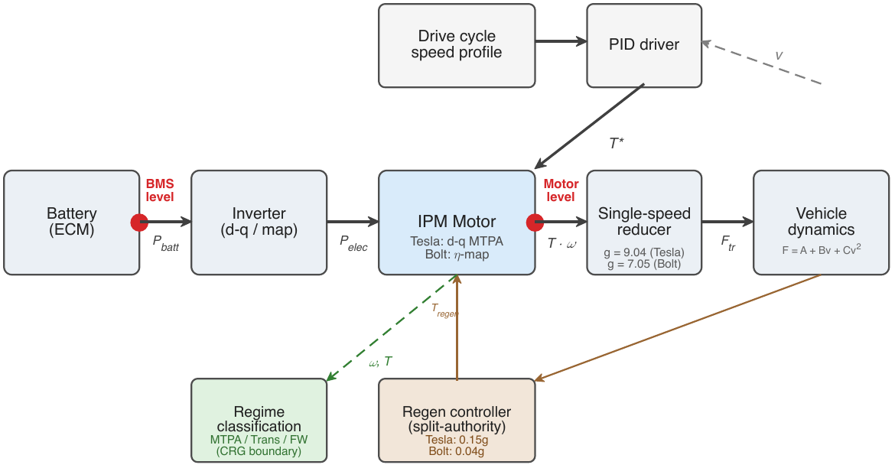

Validation targets are established using the Argonne National Laboratory Downloadable Dynamometer Database [67, 69], which provides publicly available chassis dynamometer data at 10 Hz recorded using standardised test procedures [68, 70]. Battery-level net energy consumption is determined from CAN-bus cumulative energy for the Tesla and from calibrated power analyser data (Hioki PW6001) for the Bolt, with both methods measuring high-voltage bus power at the battery terminals. The acceptance criterion is set at ±5% of the measured net Wh/km for each cycle. The LMDI decomposition is performed at the motor level, upstream of auxiliary loads and cable losses, to isolate the energy attributable to each operating regime.

Five drive cycles are evaluated, covering a spectrum from urban to aggressive motorway conditions. The Urban Dynamometer Driving Schedule (UDDS, 1369 s) and Highway Fuel Economy Test (HWFET, 765 s) are United States Environmental Protection Agency (EPA) regulatory cycles for city and highway driving, respectively. The US06 Supplemental Federal Test Procedure (600 s) represents aggressive driving, with speeds reaching 129 km/h. The Worldwide Harmonized Light Vehicles Test Procedure (WLTP) Class 3 cycle (1800 s, 23.2 km) serves as the European regulatory cycle [60]. The Artemis Motorway 130 cycle (1068 s, 28.8 km, maximum 132 km/h), derived from measured European motorway driving [59], is included as a real-world representative profile. These cycles encompass conditions ranging from zero field-weakening operation to sustained extended-speed cruise. Figure 2 presents the speed profiles for all five cycles with field-weakening onset speeds indicated for both vehicles, illustrating the contrasting regime exposure.

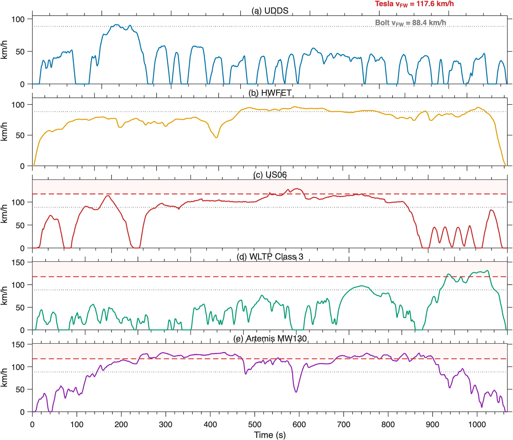

**Table 1.** Vehicle and motor parameters.

| Parameter | Tesla Model 3 LR AWD | Chevrolet Bolt EV |
|---|---|---|
| Model year | 2020 | 2020 |
| Motor type | IPM (d-q model) | Double-V IPM (efficiency map) |
| Peak power (kW) | 188 | 150 |
| Peak torque (Nm) | 353 | 360 |
| Pole pairs p | 3 | 4 |
| PM flux linkage psi_m (Wb) | 0.0772 | 0.1017 |
| Stator resistance R_s (mOhm) | 4.75 | 6.59 |
| d-axis inductance L_d (uH) | 125 | 254 (a) |
| q-axis inductance L_q (uH) | 244 | 389 (a) |
| Saliency ratio L_q/L_d | 1.95 | 1.53 |
| Modulation index k_Vmax | 1.10 | 0.904 |
| DC bus voltage V_dc (V) | 370 (b) | 350 |
| Battery capacity (kWh) | 75 | 60 |
| Gear ratio | 9.04 | 7.05 |
| Wheel radius r_w (m) | 0.326 | 0.317 |
| Test mass m_test (kg) | 1928 | 1705 |
| Road load A (N) | 162.0 | 126.3 |
| Road load B (N s/m) | 0.552 | 2.008 |
| Road load C (N s^2/m^2) | 0.315 | 0.434 |
| Auxiliary power P_aux (W) | 690 | 155 |
| Cable resistance R_cable (Ohm) | 0.015 | 0 (c) |
| Regen power cap (kW) | 60 | 50 |
| Coast regen deceleration (g) | 0.15 | 0.04 |
| FW onset speed v_FW (km/h) | 117.6 | 88.4 |

(a) Estimated from published finite element data; not used in the Simscape simulation loop. (b) Measured traction-average DC bus voltage from Argonne data; nominal battery voltage 400 V. (c) Measured cable drop 1.7 mOhm; set to zero in simulation.

### 3.2 LMDI-I decomposition framework

Aggregate motor-level energy intensity for a specified drive cycle is represented as the sum of contributions from each operating regime:

e = Σ_r S_r · I_r     (1)

Here, r denotes the motor operating regimes defined in Section 3.3. The term S_r = d_r / d_total represents the distance share in regime r (the structural factor), while I_r = E_r / d_r denotes the net energy consumption per unit distance within regime r (the intensity factor). The values d_r and E_r for each regime are calculated from instantaneous motor power and vehicle speed at each solver timestep. Net energy encompasses both traction and regenerative contributions, ensuring that I_r reflects the true energy cost of operating in regime r after accounting for energy recovery.

The difference in aggregate energy intensity between two states, A and B, is decomposed using the LMDI-I additive formulation [1, 2]:

Δe = e_B − e_A = Δ_str + Δ_int     (2)

Δ_str = Σ_r L(e_r,B, e_r,A) · ln(S_r,B / S_r,A)     (3)

Δ_int = Σ_r L(e_r,B, e_r,A) · ln(I_r,B / I_r,A)     (4)

In these expressions, e_r,k = S_r,k · I_r,k denotes the per-regime energy contribution in state k, and L(x, y) = (x − y) / (ln x − ln y) represents the logarithmic mean weight. The structural term Δ_str quantifies the portion of the energy difference attributable to changes in regime residence, while the intensity term Δ_int quantifies the portion attributable to changes in per-regime energy consumption. This decomposition is exact; the residual Δe − Δ_str − Δ_int is identically zero by construction [1].

If a regime exists in one state but is absent in the other, the standard logarithmic mean becomes undefined. In accordance with the zero-value convention of Ang and Liu [4], the entire per-regime contribution is assigned to the structural term. This approach is physically consistent, as the appearance or disappearance of a regime constitutes a structural change rather than an efficiency change. Regimes with distance shares below 1% are merged with adjacent regimes prior to decomposition, thereby preventing near-absent regimes with numerically unstable intensities from distorting the logarithmic ratios.

This framework is implemented in two configurations. In the cross-cycle comparison, states A and B correspond to different drive cycles evaluated on the same vehicle at the same gear ratio. The structural term quantifies the extent to which the Wh/km difference between cycles arises from the varying proportions of distance spent in each regime. In the cross-vehicle comparison, states A and B represent two vehicles evaluated on the same drive cycle. Here, the structural term quantifies the portion of the energy difference attributable to differing regime exposure, while the intensity term reflects differences in per-regime motor efficiency. Both configurations utilise Eqs. (2)–(4) without modification.

### 3.3 CRG-derived field-weakening boundary

The LMDI decomposition described in Section 3.2 requires classification of each solver timestep into one of three motor operating regimes. Below the field-weakening onset speed, the motor operates in the maximum torque per ampere (MTPA) regime. At and above the onset speed, the motor transitions into the field-weakening regime. A transition band, defined as the 5% speed interval immediately below the onset speed, represents the region where the current reference begins to deviate from the MTPA trajectory. This three-regime partition establishes the structural categories for the decomposition.

The onset speed for field weakening is not a fixed value but varies with torque demand. At low torque, the MTPA current vector is small, resulting in the voltage constraint being reached at a higher motor speed. Conversely, at high torque, the increased current produces greater flux linkage, causing the voltage limit to be reached at a lower speed. Consequently, the field-weakening boundary forms a curve in the torque-speed plane. The definition of this boundary determines how distance and energy are attributed to each regime, making it a critical energy accounting decision with direct implications for the decomposition.

Three boundary methods, each offering increasing physical realism, are compared. The first method (M1) defines the onset speed as omega_e = V_dc / (sqrt(3) * psi_m), representing the speed at which the back-electromotive force equals the DC bus voltage under no-load conditions. This boundary remains constant across all torque levels and does not account for saliency or load current. The second method (M2) solves the d-q voltage equation at i_d = 0, with i_q determined by the torque demand. This boundary varies with torque but does not align with the MTPA trajectory, as the assumption i_d = 0 neglects the reluctance torque contribution that shifts the optimal current vector into the negative i_d direction. The third method (M3) determines the onset speed using the motor's current reference generator, which provides the precise MTPA operating point, including saliency and reluctance torque. For the Tesla motor, the onset is identified from a lookup table using a d-axis current departure threshold of 10 A at V_dc = 370 V. For the Bolt motor, an analytically equivalent approach is applied: at each torque level, the MTPA current vector is calculated, and the speed at which the resulting terminal voltage reaches V_dc * k_Vmax / sqrt(3) defines the onset. Both implementations yield a torque-dependent boundary curve that accurately reflects the operating trajectory.

To evaluate the sensitivity of the decomposition to the voltage assumption, M3 is assessed at three DC bus voltages: 350 V, 370 V, and 400 V. The baseline value of 370 V corresponds to the average measured DC bus voltage during traction, as recorded in the Argonne dynamometer data. These five boundary definitions (M1, M2, and M3 at three voltages) are applied to identical simulation data. The net energy intensity for each cycle remains unchanged across all five definitions, indicating that the boundary alters regime classification without affecting the underlying physics. The sensitivity of the LMDI attribution to boundary selection is further quantified in Section 5.

Regenerative braking timesteps are classified using the same speed-based criterion as traction timesteps, with torque magnitude estimated from battery power and motor speed. This approach ensures that high-speed regeneration is attributed to the field-weakening regime, thereby maintaining consistent net energy intensity across all three regimes.

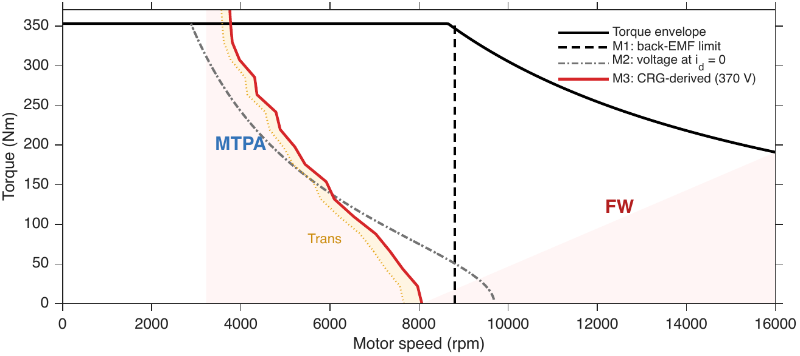

## 4. Validation results

Table 2 summarises battery-level validation results for both vehicles across four drive cycles. Simulated net Wh/km is compared to measured Argonne dynamometer targets at the battery terminals. The acceptance criterion is ±5% of the measured value. All eight cycle-vehicle combinations meet this criterion.

### 4.1 Tesla Model 3

The US06 cycle yields 148.7 Wh/km, compared with a measured 150.6 Wh/km (-1.2%). The HWFET yields 116.9 Wh/km, up from 114.4 Wh/km (+2.2%). The WLTP yields 126.6 Wh/km against 125.6 Wh/km (+0.8%). The UDDS yields 108.1 Wh/km against 109.0 Wh/km (-0.8%). The root-mean-square error throughout the four cycles is 1.4%.

The WLTP is also evaluated at the sub-phase level. The Low sub-phase yields 111.6 Wh/km versus 108.9 Wh/km (+2.5%), Medium 104.1 versus 103.6 (+0.5%), High 115.7 versus 114.4 (+1.1%), and Extra High 154.6 versus 154.2 (+0.2%). Each sub-phase meets the acceptance criterion.

Regenerative braking fractions are validated alongside net consumption. The US06 fraction is 29.4% versus 29.9%, UDDS is 33.1% versus 35.7%, HWFET is 9.8% versus 11.6%, and WLTP is 24.1% versus 26.9%. All values are within the acceptance band.

The Artemis Motorway 130 cycle does not have a corresponding Argonne dynamometer test. It is reported at 159.7 Wh/km at the battery level without a validation target.

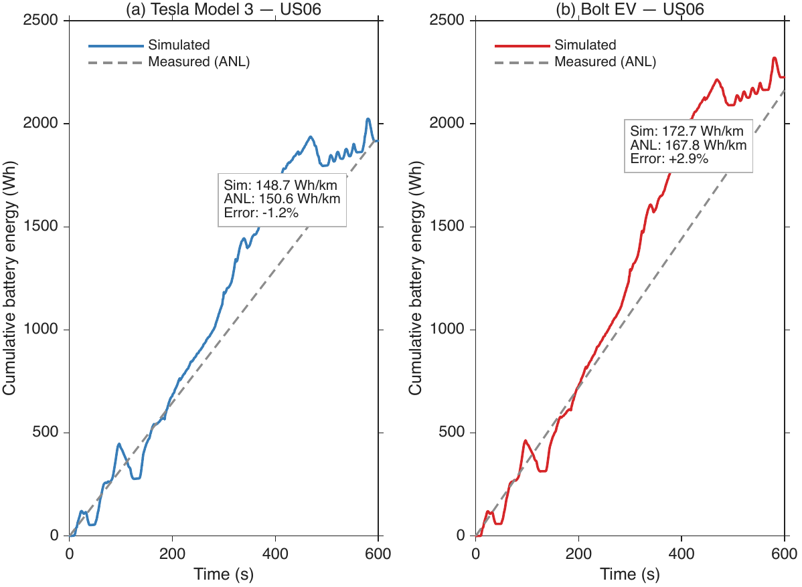

### 4.2 Chevrolet Bolt EV

The WLTP cycle yields 138.2 Wh/km against a measured 136.3 Wh/km (+1.4%). The HWFET yields 127.8 Wh/km against 125.2 Wh/km (+2.1%). The US06 yields 172.7 Wh/km against 167.8 Wh/km (+2.9%). The UDDS yields 105.9 Wh/km, compared with 101.9 Wh/km (+3.9%). The maximum error within the four cycles is 3.9%.

The Artemis Motorway 130 cycle is not available in the Argonne database for the Bolt EV. Section 5 uses the four validated cycles common to both vehicles for cross-vehicle comparisons.

**Table 2.** Battery-level validation results. Measured targets from the Argonne National Laboratory dynamometer database. Acceptance criterion: net Wh/km within 5% of the measured value. Regenerative braking fractions reported for the Tesla Model 3 only.

| Vehicle | Cycle | Measured net (Wh/km) | Simulated net (Wh/km) | Error (%) | Regen measured (%) | Regen simulated (%) |
|---|---|---|---|---|---|---|
| Tesla | UDDS | 109.0 | 108.1 | -0.8 | 35.7 | 33.1 |
| Tesla | HWFET | 114.4 | 116.9 | +2.2 | 11.6 | 9.8 |
| Tesla | WLTP | 125.6 | 126.6 | +0.8 | 26.9 | 24.1 |
| Tesla | US06 | 150.6 | 148.7 | -1.2 | 29.9 | 29.4 |
| Tesla | Artemis MW130 | -- | 159.7 | -- | -- | -- |
| Bolt | UDDS | 101.9 | 105.9 | +3.9 | -- | -- |
| Bolt | HWFET | 125.2 | 127.8 | +2.1 | -- | -- |
| Bolt | US06 | 167.8 | 172.7 | +2.9 | -- | -- |
| Bolt | WLTP | 136.3 | 138.2 | +1.4 | -- | -- |

Tesla root-mean-square error across four cycles: 1.4%. Bolt maximum error: 3.9%. The Artemis Motorway 130 has no corresponding Argonne dynamometer test for either vehicle.

## 5. LMDI decomposition results

### 5.1 Cross-cycle analysis

Table 3 and Figure 5 report the motor-level regime shares for both vehicles across the evaluated drive cycles. For the Tesla Model 3 at g = 9.04, both the UDDS and HWFET cycles operate exclusively in the MTPA regime. The WLTP allocates 21.4% of its distance to field weakening, primarily within the Extra High sub-phase. The US06 assigns 36.3% to field weakening and 12.5% to the transition band. The Artemis Motorway 130 exhibits the highest field-weakening share at 70.3%, reflecting its sustained high-speed cruise characteristics.

For the Bolt EV, all evaluated cycles enter the field-weakening regime. The UDDS allocates 20.3% of its distance to field weakening, despite a maximum speed of 91.2 km/h, due to the Bolt's field-weakening onset at 88.4 km/h. The HWFET and US06 allocate 82.3% and 89.5% of their distances, respectively, to field weakening. This consistent field-weakening exposure contrasts with the Tesla, where the UDDS and HWFET cycles remain entirely within the MTPA regime.

Table 4 presents the cross-cycle LMDI decomposition for the Tesla at g = 9.04. The UDDS to US06 comparison yields a total difference of +53.1 Wh/km, with +41.2 Wh/km (78%) attributed to structural effects and +11.9 Wh/km (22%) to intensity. The structural term is dominant because the US06 introduces 36.3% field-weakening distance, which is absent in the UDDS. The comparison between UDDS and Artemis cycles results in an increase of 66.0 Wh/km, with 80% of this difference attributed to structural effects. This outcome reflects the greater proportion of field-weakening operation in the Artemis cycle. The Artemis cycle has not been validated against dynamometer data (Section 4); therefore, this finding represents a model prediction that extrapolates the structural trend observed in the four validated cycles.

The UDDS to HWFET comparison provides a diagnostic contrast. The total difference is +21.8 Wh/km, with zero structural contribution. Since both cycles operate exclusively in the MTPA regime at g = 9.04, the entire energy difference is attributed to intensity. The motor consumes more energy per kilometre at HWFET cruise speeds than at UDDS urban speeds, despite operating within the same regime. Figure 8 juxtaposes these contrasting decompositions: the per-timestep operating points on the torque-speed plane are shown alongside waterfall diagrams for the UDDS to US06 pair (78% structural) and the UDDS to HWFET pair (0% structural). Figure 9 presents the regime-tagged energy flow for both cycles as Sankey diagrams [90], in which stream widths are proportional to Wh/km and the regime split at the motor stage is visible.

For the Bolt EV, the UDDS to US06 comparison yields +69.7 Wh/km, with 54.9% attributed to structural effects. This lower structural share, compared to the Tesla (78%), occurs because the Bolt already operates in field weakening on the UDDS (20.3% field-weakening distance). The structural contrast between cycles is reduced when both cycles include field-weakening operation.

The sensitivity of the decomposition to regime boundary definitions is assessed [85–88] by applying five boundary methods (Section 3.3) to the same Tesla g = 9.04 simulation data. Table 5 and Figure 6 report the UDDS to US06 structural share for each method. Under M1 (back-EMF limit), the structural share is 21%. Under M3 at 370 V (the baseline), it is 78%, resulting in a 57 percentage point difference. Under M3 at 350 V, the structural share exceeds 100%, indicating a slightly negative intensity contribution. A wider field-weakening band at lower voltage reduces per-regime intensity. Net energy intensity remains constant across all five methods, confirming that boundary changes affect regime classification but do not alter total energy consumption. The choice of boundary method determines whether the UDDS to US06 difference is attributed to structure or intensity.

**Table 3.** Motor-level regime distance shares and net energy intensity. Tesla at g = 9.04; Bolt at g = 7.05. Transition band defined as the 5% speed interval below the CRG field-weakening onset.

| Vehicle | Cycle | Net Wh/km | S_MTPA (%) | S_Trans (%) | S_FW (%) |
|---|---|---|---|---|---|
| Tesla | UDDS | 86.0 | 100.0 | 0.0 | 0.0 |
| Tesla | HWFET | 107.8 | 100.0 | 0.0 | 0.0 |
| Tesla | WLTP | 111.4 | 74.5 | 4.1 | 21.4 |
| Tesla | US06 | 139.1 | 51.2 | 12.5 | 36.3 |
| Tesla | Artemis MW130 | 152.0 | 20.5 | 9.2 | 70.3 |
| Bolt | UDDS | 101.0 | 79.7 | 0.0 | 20.3 |
| Bolt | HWFET | 125.8 | 9.9 | 7.8 | 82.3 |
| Bolt | WLTP | 134.9 | 47.0 | 1.9 | 51.1 |
| Bolt | US06 | 170.7 | 9.4 | 1.1 | 89.5 |

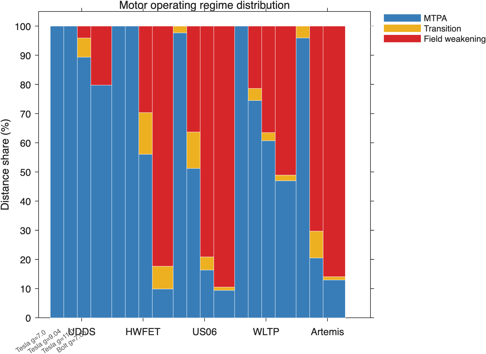

**Table 4.** Cross-cycle LMDI-I decomposition (Wh/km, motor level). The structural share S indicates the proportion of the total difference attributable to changes in regime residence.

| Vehicle | Pair | Delta | Structural | Intensity | S share (%) |
|---|---|---|---|---|---|
| Tesla | UDDS to HWFET | +21.8 | 0.0 | +21.8 | 0 |
| Tesla | UDDS to WLTP | +25.4 | +19.3 | +6.2 | 75.7 |
| Tesla | UDDS to US06 | +53.1 | +41.2 | +11.9 | 77.6 |
| Tesla | UDDS to Artemis | +66.0 | +52.6 | +13.4 | 79.7 |
| Tesla | WLTP to Artemis | +40.6 | +34.7 | +5.9 | 85.5 |
| Bolt | UDDS to HWFET | +24.9 | +21.0 | +3.9 | 84.3 |
| Bolt | UDDS to US06 | +69.7 | +38.2 | +31.5 | 54.9 |
| Bolt | UDDS to WLTP | +33.9 | +19.1 | +14.8 | 56.3 |

All residuals below 4 x 10^-14 Wh/km. The UDDS to HWFET pair for the Tesla yields zero structural contribution because both cycles operate entirely within the MTPA regime at g = 9.04.

**Table 5.** Sensitivity of the UDDS to US06 decomposition to regime boundary definition. All five methods are applied to the same Tesla g = 9.04 simulation data. The total energy difference (Delta = +53.1 Wh/km) is identical across all methods; only the structural-intensity partition changes.

| Method | Voltage (V) | US06 S_FW (%) | Structural (Wh/km) | Intensity (Wh/km) | S share (%) |
|---|---|---|---|---|---|
| M1 (back-EMF) | 370 | 6.4 | +11.1 | +42.0 | 20.9 |
| M2 (voltage at i_d = 0) | 370 | 13.4 | +37.8 | +15.2 | 71.3 |
| M3 (CRG) | 350 | 51.5 | +54.4 | -1.3 | 102.5 |
| M3 (CRG) | 370 | 36.3 | +41.2 | +11.9 | 77.6 |
| M3 (CRG) | 400 | 11.5 | +22.4 | +30.7 | 42.2 |

The structural share ranges from 20.9% (M1) to 102.5% (M3 at 350 V), a span of 82 percentage points. An S share exceeding 100% indicates a negative intensity contribution: a wider field-weakening band reduces per-regime intensity, offsetting the structural cost.

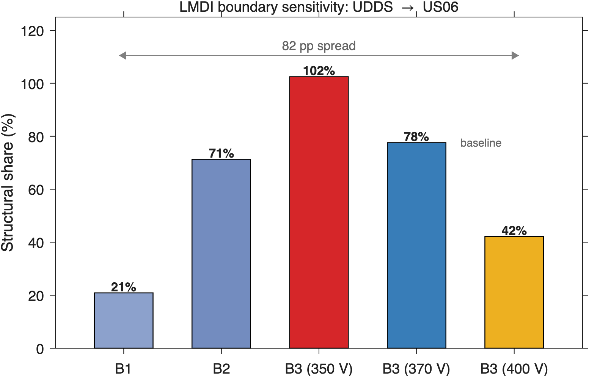

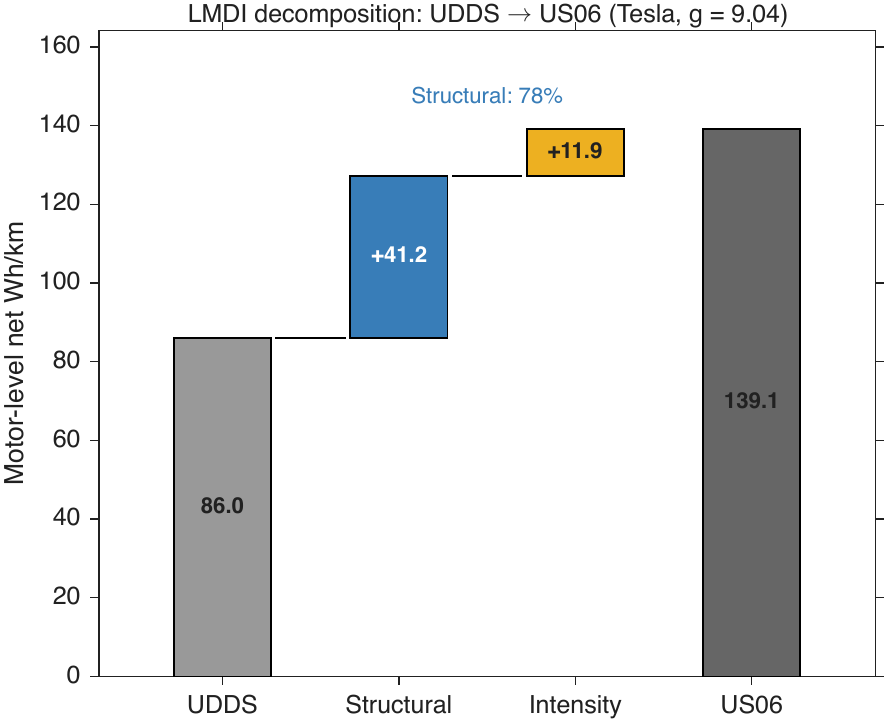

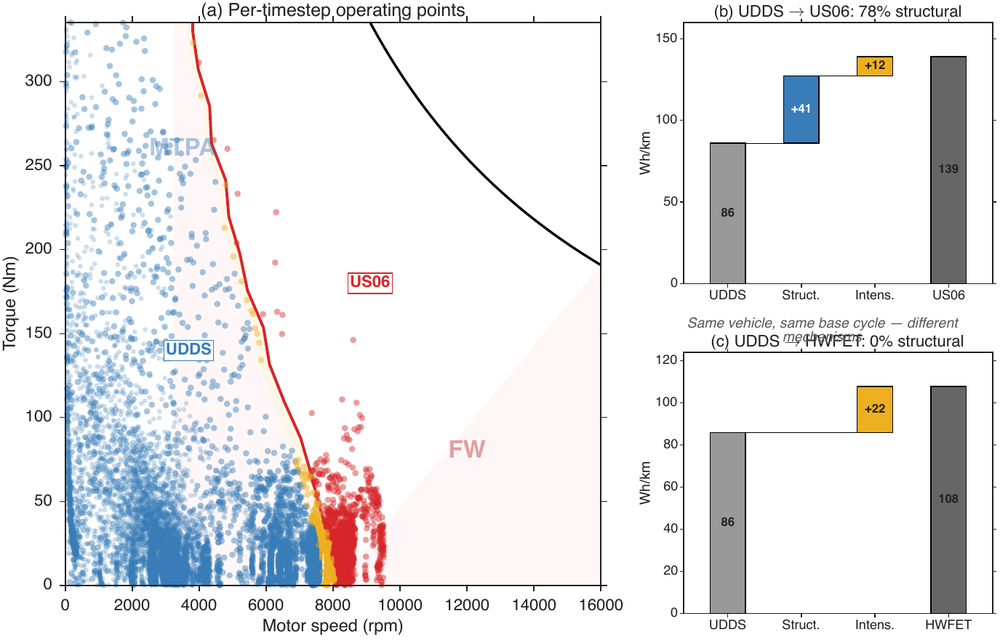

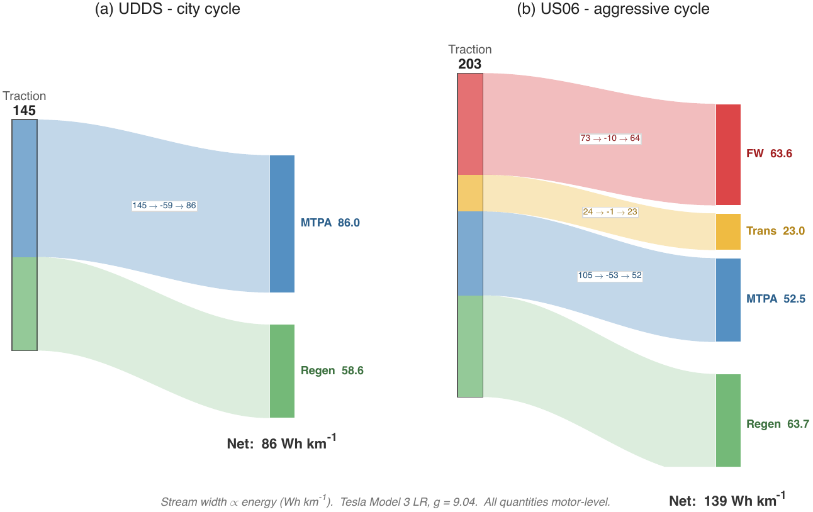

### 5.2 Cross-vehicle comparison

Table 6 presents the cross-vehicle LMDI decomposition, comparing the Tesla Model 3 (g = 9.04) and the Bolt EV (g = 7.05) on identical drive cycles. In every case, the Bolt consumes more energy than the Tesla at the motor level.

On the HWFET, the Bolt consumes 18.0 Wh/km more than the Tesla, with 99.1% of this difference attributed to structural effects. This energy difference results from the Bolt operating in field weakening for 82.3% of the HWFET distance, while the Tesla remains in the MTPA regime. The WLTP yields a difference of +23.5 Wh/km, with 97.7% structural, and the US06 yields +31.6 Wh/km, with 88.1% structural.

The UDDS provides a contrasting result. The Bolt consumes 15.0 Wh/km more than the Tesla, but the structural share drops to 57.2%. The Bolt enters field weakening on the UDDS because its onset speed (88.4 km/h) falls below the cycle maximum (91.2 km/h). The Tesla, with an onset speed of 117.6 km/h, remains in MTPA. The smaller structural share on the UDDS results because the Bolt's field-weakening exposure is limited to a narrow speed band near the cycle peak, producing a modest structural contrast alongside a non-negligible intensity difference.

The Bolt features a lower gear ratio (7.05 versus 9.04), which would typically reduce motor speed and decrease field-weakening operation if all other parameters were identical. The Bolt's permanent magnet flux linkage (0.1017 Wb), DC bus voltage (350 V), and modulation index (0.904) produce a lower field-weakening onset speed compared to the Tesla's parameters (0.0772 Wb, 370 V, 1.10). Motor design, rather than gear ratio, governs regime exposure.

**Table 6.** Cross-vehicle LMDI-I decomposition (Wh/km, motor level). Comparison direction: Tesla Model 3 (g = 9.04) to Chevrolet Bolt EV (g = 7.05) on the same drive cycle. Positive values indicate higher consumption for the Bolt.

| Cycle | Delta | Structural | Intensity | S share (%) | Residual |
|---|---|---|---|---|---|
| UDDS | +14.96 | +8.55 | +6.41 | 57.2 | 6.3 x 10^-14 |
| HWFET | +18.02 | +17.86 | +0.17 | 99.1 | 9.4 x 10^-15 |
| US06 | +31.60 | +27.83 | +3.77 | 88.1 | 4.4 x 10^-14 |
| WLTP | +23.47 | +22.94 | +0.53 | 97.7 | 1.1 x 10^-14 |

On HWFET, US06, and WLTP, 88 to 99% of the motor-level energy difference between the two vehicles is structural. The Bolt operates in field weakening for 82.3% (HWFET), 89.5% (US06), and 51.1% (WLTP) of its distance, while the Tesla remains in the MTPA regime on HWFET and allocates 36.3% (US06) and 21.4% (WLTP) to field weakening.

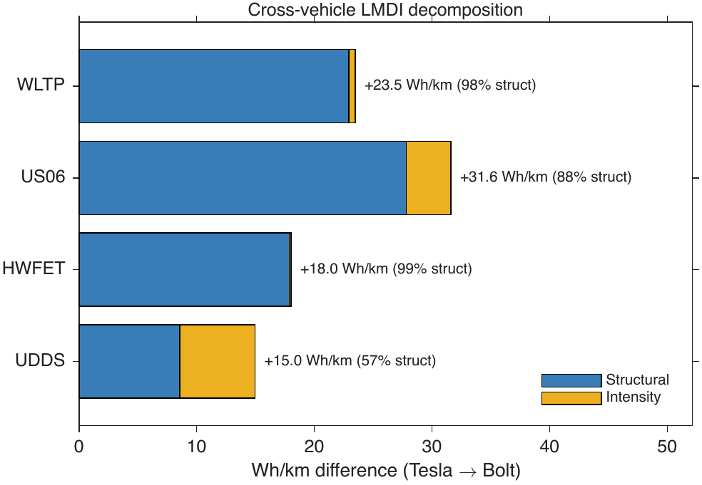

### 5.3 Gear ratio design implications

Three gear ratios (7.0, 9.04, and 11.0) are evaluated for the Tesla Model 3 across all five drive cycles. The motor, battery, road load, and drive cycle remain constant in each scenario; only the gear ratio varies. Table 7 presents the motor-level net Wh/km and regime shares for each configuration.

Increasing the gear ratio from 7.0 to 11.0 results in higher motor-level net energy consumption across all cycles. The penalty ranges from +5.2 Wh/km on the UDDS to +14.4 Wh/km on the Artemis Motorway 130. The magnitude of this increase correlates with the extent of field-weakening exposure; the Artemis cycle, characterised by prolonged high-speed segments, produces the largest increase.

Table 8 and Figure 11 present the cross-gear LMDI decomposition. For cycles where the gear change introduces or significantly increases field-weakening operation, both structural and intensity terms are substantial and partially offsetting. On the US06, increasing the gear ratio from 7.0 to 11.0 results in a total penalty of +11.6 Wh/km, with a structural contribution of +59.4 Wh/km and an intensity contribution of -47.8 Wh/km. The structural term exceeds the total because shifting distance from MTPA to field weakening simultaneously reduces per-regime intensity, as the motor operates at partial load within a broader field-weakening band. The Artemis cycle exhibits a similar pattern: +14.4 Wh/km total, +40.2 structural, and -25.8 intensity.

For cycles where both gear ratios remain below the field-weakening onset, the gear penalty manifests solely as intensity. The UDDS at g = 7.0 and g = 9.04 operates entirely in the MTPA regime. The +2.7 Wh/km penalty is attributed entirely to intensity, as the motor operates at higher speed and torque for the same vehicle demand, resulting in increased per-kilometre losses within the same regime.

In high-speed cycles, increasing the gear ratio shifts motor operation into field weakening, resulting in a structural energy penalty. The magnitude of this penalty depends on the cycle's speed profile and the motor's field-weakening onset speed. The LMDI decomposition identifies which mechanism dominates for each cycle and gear ratio combination.

**Table 7.** Motor-level net energy intensity and field-weakening distance share for the Tesla Model 3 at three gear ratios. All vehicle, motor, road load, and drive cycle parameters are held constant; only the gear ratio varies.

| Cycle | Net g = 7.0 | S_FW g = 7.0 (%) | Net g = 9.04 | S_FW g = 9.04 (%) | Net g = 11.0 | S_FW g = 11.0 (%) |
|---|---|---|---|---|---|---|
| UDDS | 83.3 | 0 | 86.0 | 0 | 88.5 | 4.1 |
| HWFET | 103.0 | 0 | 107.8 | 0 | 113.3 | 29.7 |
| WLTP | 107.1 | 0 | 111.4 | 21.4 | 116.4 | 36.5 |
| US06 | 133.8 | 0 | 139.1 | 36.3 | 145.4 | 79.1 |
| Artemis MW130 | 146.4 | 0 | 152.0 | 70.3 | 160.8 | 85.9 |

Net energy intensity is in Wh/km at the motor level. At g = 7.0, all cycles operate below the field-weakening onset (151.9 km/h). At g = 11.0, field-weakening operation appears on all cycles, including the UDDS (onset 96.7 km/h).

**Table 8.** Cross-gear LMDI-I decomposition for the Tesla Model 3 (Wh/km, motor level). The UDDS at g = 7.0 to 9.04 is included to illustrate the pure-intensity case where both gear ratios remain below the field-weakening onset.

| Cycle | Gear pair | Delta | Structural | Intensity |
|---|---|---|---|---|
| UDDS | 7.0 to 9.04 | +2.7 | 0.0 | +2.7 |
| UDDS | 7.0 to 11.0 | +5.2 | +4.8 | +0.4 |
| HWFET | 7.0 to 11.0 | +10.2 | +9.3 | +0.9 |
| WLTP | 7.0 to 11.0 | +9.2 | +23.4 | -14.2 |
| US06 | 7.0 to 11.0 | +11.6 | +59.4 | -47.8 |
| Artemis MW130 | 7.0 to 11.0 | +14.4 | +40.2 | -25.8 |

On cycles where the gear change introduces field-weakening operation (WLTP, US06, Artemis), the structural and intensity contributions are both large and partially offsetting. The structural term exceeds the total because shifting distance into field weakening simultaneously reduces per-regime intensity. On cycles where both gear ratios remain in the MTPA regime (UDDS at g = 7.0 to 9.04), the entire penalty is attributed to intensity.

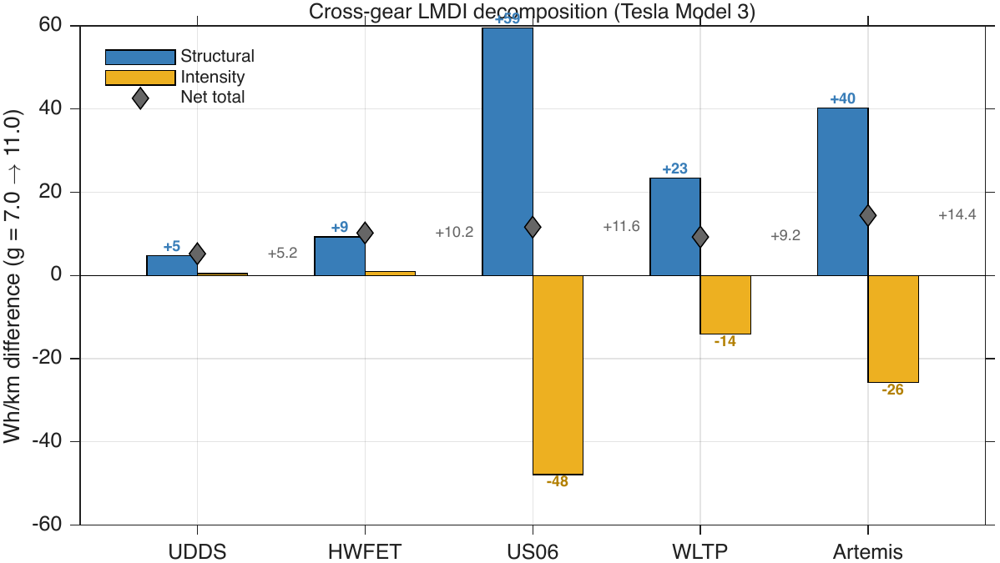

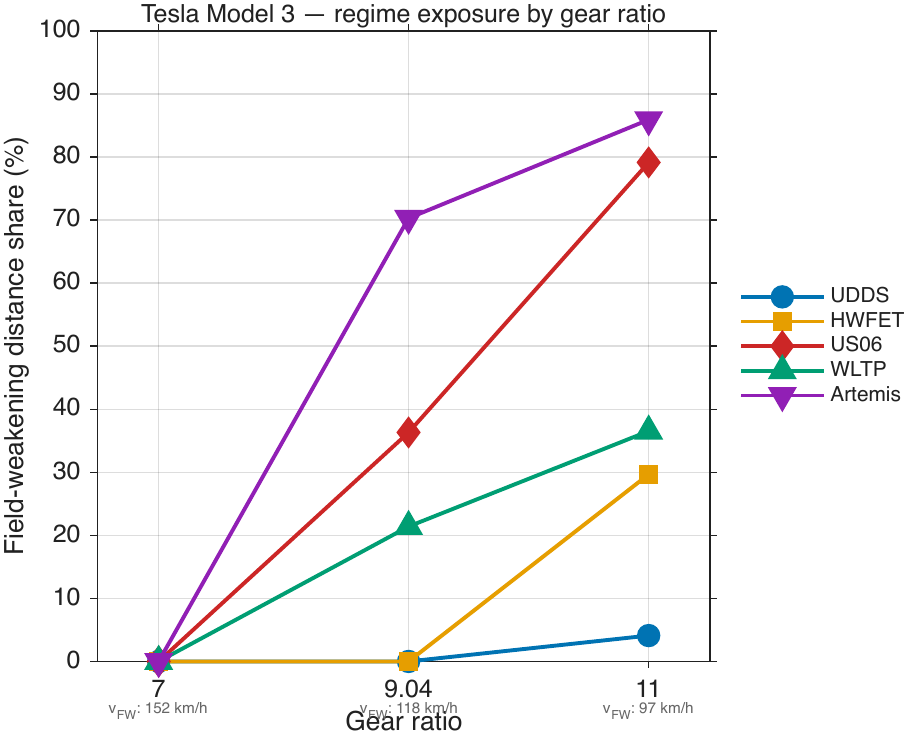

## 6. Discussion

Vehicle-level Wh/km serves as the standard metric for comparing battery electric vehicle energy consumption across various drive cycles and vehicles. While this metric provides an aggregate outcome, it does not reveal the underlying physical mechanisms responsible for differences in consumption. The LMDI decomposition addresses this limitation by separating the aggregate into two components: the structural term, which quantifies the extent to which differences arise from the distribution of distance across operating regimes, and the intensity term, which quantifies the contribution from changes in per-regime energy consumption.

Comparisons between the UDDS and HWFET, as well as the UDDS and US06 cycles for the Tesla Model 3, exemplify this distinction. In both cases, energy consumption increases on the more demanding cycle. The difference between UDDS and HWFET (+21.8 Wh/km) is attributable entirely to intensity, as both cycles operate within the MTPA regime, and the higher cruise speed of the HWFET increases per-kilometre losses within that regime. In contrast, the UDDS to US06 difference (+53.1 Wh/km) is 78% structural, since the US06 introduces field-weakening operation absent in the UDDS. Although vehicle-level Wh/km treats these as equivalent increases in consumption, the decomposition identifies that the underlying causes are fundamentally different.

The cross-vehicle comparison further supports this finding. The Bolt EV consumes between 18.0 and 31.6 Wh/km more than the Tesla Model 3 across matched cycles [78, 79], with structural effects accounting for 88 to 99% of the difference in three out of four cycles. While a vehicle-level comparison might attribute this gap to aggregate efficiency differences between the two motors, the decomposition demonstrates that the Bolt EV's higher consumption primarily results from increased residence in the field-weakening regime, a consequence of its lower onset speed (88.4 km/h compared to 117.6 km/h), rather than from inferior per-regime efficiency.

The gear ratio sweep isolates the effect of transmission ratio on regime exposure while maintaining all other vehicle parameters constant. Increasing the gear ratio from 7.0 to 11.0 increases motor-level consumption by 5.2 Wh/km on the UDDS and 14.4 Wh/km on the Artemis Motorway 130. For high-speed cycles, the structural and intensity contributions are both significant and partially offset each other. On the US06 cycle, the structural contribution is 59.4 Wh/km, while the intensity contribution is -47.8 Wh/km, resulting in a net penalty of 11.6 Wh/km. This net figure understates the structural cost of the regime shift because the motor operates at partial load within a broader field-weakening band, thereby reducing per-regime intensity. A lower gear ratio avoids field-weakening operation on moderate-speed cycles but reduces available wheel torque at low vehicle speeds. Conversely, a higher gear ratio provides greater launch torque but incurs a structural energy penalty on motorway and aggressive cycles. The LMDI decomposition quantifies this trade-off for each combination of cycle and gear ratio, offering a basis for gear ratio selection [93] that incorporates the structural energy cost of regime transition.

The regime shares presented in Table 3 indicate that a single vehicle can experience fundamentally different structural exposures depending on the drive cycle. For the Tesla Model 3 at a gear ratio of 9.04, both the UDDS and HWFET operate exclusively in the MTPA regime, whereas the Artemis Motorway 130 allocates 70.3% of distance to field-weakening operation. A regulatory assessment based solely on the UDDS would not capture the structural energy cost incurred by this vehicle under motorway conditions. In contrast, the Bolt EV demonstrates the opposite pattern: all evaluated cycles, including the UDDS, enter the field-weakening regime, so no regulatory cycle fully avoids the structural energy cost of field-weakening operation for this vehicle. The Artemis Motorway 130, based on measured European driving data, captures motorway conditions that are understated by regulatory cycles. The 70.3% field-weakening share for the Tesla Model 3 on this cycle, compared with 21.4% on the WLTP and 0% on the UDDS, quantifies the discrepancy between regulatory and on-road structural exposure. This finding has implications for energy labelling and range estimation, as the choice of reference cycle determines whether the structural energy cost of field-weakening operation is reflected in the published consumption figure.

Several limitations should be acknowledged in this study. The dynamometer data are recorded at 10 Hz, resulting in sub-second transients in torque and current being averaged within each sample. For the Tesla Model 3, iron losses are calculated from d-q current lookup tables during post-processing, rather than from coupled electromagnetic simulations. For the Bolt EV, motor parameters such as permanent magnet flux linkage and stator resistance are obtained from published finite element analysis and benchmarking reports [72–74], not from direct motor testing. The traction driver employs a proportional-integral controller to track the reference speed profile, which does not replicate the full range of human driving variability, including anticipatory braking and variable pedal modulation. Additionally, the analysis is restricted to single-speed drivetrains; multi-speed or continuously variable transmissions would necessitate additional regime definitions and a revised structural decomposition framework.

The Artemis Motorway 130 results extend the model into sustained field-weakening operation for 70.3% of the distance, surpassing the previously validated maximum share of 36.3% observed on the US06. Several factors reinforce confidence in this extrapolation. The d-q motor model and CRG-derived boundary are continuous functions of speed and torque, with no parameter discontinuity at elevated motor speeds. The WLTP Extra High sub-phase, which encompasses sustained cruising above the field-weakening threshold, demonstrates a validation error of +0.2% (154.6 versus 154.2 Wh/km). Road load, battery equivalent circuit, and regenerative braking logic are each validated independently of the motor operating regime. However, direct measurement confirmation at the 70.3% field-weakening share remains unavailable, and the Artemis results should be regarded as computed predictions rather than validated outcomes.

## 7. Conclusion

LMDI-I decomposition was applied within the battery electric vehicle powertrain for the first time, partitioning drive cycle energy consumption into structural effects (regime residence) and intensity effects (per-regime efficiency) for two production vehicles validated across four drive cycles and extended to a fifth.

For the Tesla Model 3 at a gear ratio of 9.04, structural effects account for 78% of the 53.1 Wh/km difference between the UDDS and US06 cycles. The difference between UDDS and HWFET cycles (+21.8 Wh/km) is entirely due to intensity, confirming that the decomposition distinguishes regime-shift energy costs from within-regime efficiency changes. Cross-vehicle comparisons on matched cycles attribute 88 to 99% of the motor-level energy difference between the Tesla and Bolt EV to structural effects on three of four cycles. The Bolt EV enters field-weakening operation at 88.4 km/h, compared with 117.6 km/h for the Tesla, despite a lower gear ratio (7.05 versus 9.04). Motor design parameters determine regime exposure.

The regime boundary method alters energy attribution by as much as 57 percentage points for identical simulation data. Five boundary definitions, ranging from a simplified back-EMF voltage limit to a torque-dependent trajectory derived from the motor's operating point, yield the same net energy consumption but partition it differently between the structural and intensity terms. The regime boundary represents an energy accounting decision with significant consequences for attribution.

An increase in gear ratio from 7.0 to 11.0 raises motor-level consumption by 5.2 to 14.4 Wh/km, depending on the drive cycle. On high-speed cycles, the structural and intensity contributions are both substantial and partially offsetting. For example, on the US06 cycle, the structural term is +59.4 Wh/km and the intensity term is -47.8 Wh/km, resulting in a net penalty of +11.6 Wh/km. The net consumption figure alone understates the structural cost associated with the regime shift.

Model estimates for the Artemis Motorway 130, which does not include a dynamometer validation target, show that the Tesla operates in the field-weakening regime for 70.3% of the distance. This contrasts with 21.4% on the WLTP and 0% on the UDDS. Regulatory cycles that rely on urban and suburban speed profiles fail to account for the structural energy cost associated with field-weakening operation during motorway conditions. The decomposition provides a quantitative diagnostic for linking drive cycle definition, motor design, and transmission gearing to energy consumption in battery electric vehicles.

Future research will extend the decomposition to multi-speed drivetrains [43, 44, 47], incorporate thermal effects on motor parameters [71], and apply the method to on-road driving data recorded under varying ambient conditions [19, 89].

---

## References

1. Ang BW. Decomposition analysis for policymaking in energy: which is the preferred method? *Energy Policy* 2004;32(9):1131-1139.
2. Ang BW. The LMDI approach to decomposition analysis: a practical guide. *Energy Policy* 2005;33(7):867-871.
3. Ang BW. LMDI decomposition approach: a guide for implementation. *Energy Policy* 2015;86:233-238.
4. Ang BW, Liu N. Handling zero values in the logarithmic mean Divisia index decomposition approach. *Energy Policy* 2007;35(1):238-246.
5. Ang BW, Xu XY, Su B. Multi-country comparisons of energy performance: the index decomposition analysis approach. *Energy Economics* 2015;47:68-76.
6. Choi KH, Ang BW. Attribution of changes in Divisia real energy intensity index -- an extension to index decomposition analysis. *Energy Economics* 2012;34(1):171-176.
7. Xu XY, Ang BW. Analysing residential energy consumption using index decomposition analysis. *Applied Energy* 2014;113:342-351.
8. Xiang N, Wang F, Cheng Z. The misinterpretation of structure effects of the LMDI and an alternative index decomposition. *Journal of Cleaner Production* 2022;351:131437.
9. Zhang M, Li H, Zhou M, Mu H. Decomposition analysis of energy consumption in Chinese transportation sector. *Applied Energy* 2011;88(6):2279-2285.
10. Liu M, Zhang X, Zhang M, Feng Y, Liu Y, Wen J, Liu L. Influencing factors of carbon emissions in transportation industry based on CD function and LMDI decomposition model: China as an example. *Environmental Impact Assessment Review* 2021;90:106623.
11. Achour H, Belloumi M. Decomposing the influencing factors of energy consumption in Tunisian transportation sector using the LMDI method. *Transport Policy* 2016;52:64-71.
12. Jain S, Mehta K. Analysing driving factors of India's transportation sector CO2 emissions: based on LMDI decomposition method. *Heliyon* 2023;9(3):e14011.
13. Kim S. Decomposition analysis of greenhouse gas emissions in Korea's transportation sector. *Sustainability* 2019;11(7):1986.
14. Solaymani S. CO2 emissions patterns in 7 top carbon emitter economies: the case of transport sector. *Energy* 2019;168:989-1001.
15. Gu J, Li P, Yang H. An analysis of the decomposition and driving force of carbon emissions in transport sector in China. *Scientific Reports* 2024;14:2793.
16. Goh T, Ang BW, Su B, Wang H. Drivers of stagnating global carbon intensity of electricity and the way forward. *Energy Policy* 2018;113:149-156.
17. Xie Y, Li Y, Zhao Z, Dong H, Wang S, Liu J, Guan J, Duan X. Microsimulation of electric vehicle energy consumption and driving range. *Applied Energy* 2020;267:114892.
18. Miri I, Fotouhi A, Ewin N. Electric vehicle energy consumption modelling and estimation -- a case study. *International Journal of Energy Research* 2021;45(1):501-520.
19. Zhai Z, Xu J, Karner D. Modeling energy consumption for battery electric vehicles based on in-use vehicle trajectories. *Transportation Research Part D* 2024;127:104073.
20. Castillo-Calderon J, Rosales-Asensio E, Gonzalez-Martinez A. Energy consumption prediction in battery electric vehicles: a systematic literature review. *Energies* 2026;19(4):981.
21. Achariyaviriya W, Janpoom K, Jermsurawong J, Nakkiew W. Estimating energy consumption of battery electric vehicles using vehicle sensor data and machine learning approaches. *Energies* 2023;16(17):6227.
22. Fiori C, Ahn K, Rakha HA. Power-based electric vehicle energy consumption model: model development and validation. *Applied Energy* 2016;168:257-268.
23. De Cauwer C, Van Mierlo J, Coosemans T. Energy consumption prediction for electric vehicles based on real-world data. *Energies* 2015;8(8):8573-8593.
24. Galvin R. Energy consumption effects of speed and acceleration in electric vehicles: laboratory case studies and implications for drivers and policymakers. *Transportation Research Part D* 2017;53:234-248.
25. Karabasoglu O, Michalek J. Influence of driving patterns on life cycle cost and emissions of hybrid and plug-in electric vehicle powertrains. *Energy Policy* 2013;60:445-461.
26. Wu X, Freese D, Cabez A, Kitch WA. Electric vehicles energy consumption measurement and estimation. *Transportation Research Part D* 2015;34:52-67.
27. Mruzek M, Gajdac I, Kucera L, Barta D. Analysis of parameters influencing electric vehicle range. *Procedia Engineering* 2016;134:165-174.
28. Yuksel T, Michalek JJ. Effects of regional temperature on electric vehicle efficiency, range, and emissions in the United States. *Environmental Science and Technology* 2015;49(6):3228-3235.
29. Grunditz EA, Thiringer T. Performance analysis of current BEVs based on a comprehensive review of specifications. *IEEE Transactions on Transportation Electrification* 2016;2(3):270-289.
30. Morimoto S, Takeda Y, Hirasa T, Taniguchi K. Expansion of operating limits for permanent magnet motor by current vector control considering inverter capacity. *IEEE Transactions on Industry Applications* 1990;26(5):866-871.
31. Bianchi N, Bolognani S, Chalmers BJ. Salient-rotor PM synchronous motors for an extended flux-weakening operation range. *IEEE Transactions on Industry Applications* 2000;36(4):1118-1125.
32. Soong WL, Miller TJE. Field-weakening performance of brushless synchronous AC motor drives. *IEE Proceedings -- Electric Power Applications* 1994;141(6):331-340.
33. Zhu ZQ, Howe D. Electrical machines and drives for electric, hybrid, and fuel cell vehicles. *Proceedings of the IEEE* 2007;95(4):746-765.
34. Williamson SS, Rathore AK, Musavi F. Industrial electronics for electric transportation: current state-of-the-art and future challenges. *IEEE Transactions on Industrial Electronics* 2015;62(5):3021-3032.
35. Pellegrino G, Vagati A, Boazzo B, Guglielmi P. Comparison of induction and PM synchronous motor drives for EV application including design examples. *IEEE Transactions on Industry Applications* 2012;48(6):2322-2332.
36. Jahns TM, Kliman GB, Neumann TW. Interior permanent-magnet synchronous motors for adjustable-speed drives. *IEEE Transactions on Industry Applications* 1986;IA-22(4):738-747.
37. Niazi P, Toliyat HA, Cheong D, Kim JC. A low-cost and efficient permanent-magnet-assisted synchronous reluctance motor drive. *IEEE Transactions on Industry Applications* 2007;43(2):542-550.
38. Reddy PB, El-Refaie AM, Huh KK, Tangudu JK, Jahns TM. Comparison of interior and surface PM machines equipped with fractional-slot concentrated windings for hybrid traction applications. *IEEE Transactions on Energy Conversion* 2012;27(3):593-602.
39. Nguyen QD, Nguyen HP, Vo DN, Nguyen LT, Nguyen ST. Effect of battery voltage variation on electric vehicle performance driven by induction machine with optimal flux-weakening strategy. *IET Electrical Systems in Transportation* 2020;10(3):301-308.
40. Niu S, Qiu H. The optimal design and research of interior permanent magnet synchronous motors for electric vehicle applications. *The Journal of Engineering* 2023;2023(2):e12258.
41. Spanoudakis P, Tsourveloudis NC, Dokas L, Chaniotakis A. Efficient gear ratio selection of a single-speed drivetrain for improved electric vehicle energy consumption. *Sustainability* 2020;12(21):9254.
42. Ren Q, Crolla DA, Morris A. Effect of transmission design on electric vehicle (EV) performance. *Vehicle Power and Propulsion Conference (VPPC)*, IEEE, 2009;3508-3513.
43. Sorniotti A, Suber T, Stockinger M, Gruber P, Cesari F, Perez H, Turner A. Performance and integrity testing of a novel clutch actuator. *SAE International Journal of Passenger Cars* 2012;5(2):827-837.
44. Gao B, Liang Q, Xiang Y, Guo L, Chen H. Gear ratio optimization and shift control of 2-speed I-AMT in electric vehicle. *Mechanical Systems and Signal Processing* 2015;50:615-631.
45. Hofman T, Dai CH. Energy efficiency analysis and comparison of transmission technologies for an electric vehicle. *Vehicle Power and Propulsion Conference (VPPC)*, IEEE, 2010;1-6.
46. Srivastava N, Haque I. A review on belt and chain continuously variable transmissions (CVT): dynamics and control. *Mechanism and Machine Theory* 2009;44(1):19-41.
47. Di Nicola F, Sorniotti A, Holdstock T, Viotto F, Bertolotto S. Optimization of a multiple-speed transmission for downsizing the motor of a fully electric vehicle. *SAE International Journal of Alternative Powertrains* 2012;1(1):134-143.
48. Yenipinar V. Impact of gear ratios on drive cycle efficiency and thermal performance in lightweight EVs. *International Journal of Numerical Modelling* 2026;39(3):e70149.
49. Geng C, Ning D, Guo L, Xue Q, Mei Y. Simulation research on regenerative braking control strategy of hybrid electric vehicle. *Energies* 2021;14(8):2202.
50. Jiang B, Tian Q, Ding J. Regenerative braking control strategy of electric vehicles based on braking stability requirements. *International Journal of Automotive Technology* 2021;22:465-476.
51. Li W, Du H, Li W. Regenerative braking control strategy for pure electric vehicles based on fuzzy neural network. *Ain Shams Engineering Journal* 2023;14(8):102262.
52. Yin Z, Hu G, Hu Z, Xu Y. A logic threshold control strategy to improve the regenerative braking energy recovery of electric vehicles. *Sustainability* 2023;15(4):3214.
53. Nah ANH, Phu TT, Truong NV. An efficient regenerative braking system for electric vehicles based on a fuzzy control strategy. *Vehicles* 2024;6(4):1838-1852.
54. Lv C, Zhang J, Li Y, Yuan Y. Mechanism analysis and evaluation methodology of regenerative braking contribution to energy efficiency improvement of electrified vehicles. *Energy Conversion and Management* 2015;92:469-482.
55. Qiu C, Wang G, Meng M, Shen YJ. A novel control strategy of regenerative braking system for electric vehicles under safety critical driving situations. *Energy* 2018;149:329-340.
56. Bera TK, Bhattacharya K, Samantaray AK. Evaluation of regenerative braking effect on energy efficiency in various hybrid and electric vehicles. *SAE Technical Paper* 2021;2021-26-0020.
57. Zhang J, Lv C, Gou J, Kong D. Cooperative control of regenerative braking and hydraulic braking of an electrified passenger car. *Proceedings of the Institution of Mechanical Engineers, Part D* 2012;226(10):1289-1302.
58. Xu G, Li W, Xu K, Song Z. An intelligent regenerative braking strategy for electric vehicles. *Energies* 2011;4(9):1461-1477.
59. Andre M. The ARTEMIS European driving cycles for measuring car pollutant emissions. *Science of the Total Environment* 2004;334-335:73-84.
60. Tutuianu M, Bonnel P, Ciuffo B, Haniu T, Ichikawa N, Marotta A, Pavlovic J, Steven H. Development of the World-wide harmonized Light duty Test Cycle (WLTC) and a possible pathway for its introduction in the European legislation. *Transportation Research Part D* 2015;40:61-75.
61. Tsiakmakis S, Fontaras G, Cubito C, Pavlovic J, Anagnostopoulos K, Ciuffo B. From NEDC to WLTP: effect on the type-approval CO2 emissions of light-duty vehicles. *JRC Technical Reports*, European Commission, 2017.
62. Pavlovic J, Marotta A, Ciuffo B. CO2 emissions and energy demands of vehicles tested under the NEDC and the new WLTP type approval test procedures. *Applied Energy* 2016;177:661-670.
63. Fontaras G, Zacharof NG, Ciuffo B. Fuel consumption and CO2 emissions from passenger cars in Europe -- laboratory versus real-world emissions. *Progress in Energy and Combustion Science* 2017;60:97-131.
64. Barlow TJ, Latham S, McCrae IS, Boulter PG. A reference book of driving cycles for use in the measurement of road vehicle emissions. TRL Published Project Report PPR354, 2009.
65. Tsiakmakis S, Fontaras G, Anagnostopoulos K, Ciuffo B, Pavlovic J, Marotta A. A simulation-based methodology for quantifying European passenger car fleet CO2 emissions. *Applied Energy* 2017;199:447-465.
66. Cubito C, Millo F, Boccardo G, Di Pierro G, Ciuffo B, Fontaras G. Impact of different driving cycles and operating conditions on CO2 emissions and energy management strategies of a Euro-6 hybrid electric vehicle. *Energies* 2017;10(10):1590.
67. Duoba M, Carlson R, Wu J, Bohn T, Jehlik F. Argonne facility and tools for plug-in hybrid electric vehicle testing. *SAE Technical Paper* 2009;2009-01-1335.
68. Kim N, Duoba M, Kim N, Rousseau A. Validating volt PHEV model with dynamometer test data using Autonomie. *SAE International Journal of Passenger Cars* 2013;6(2):985-992.
69. Argonne National Laboratory. Downloadable Dynamometer Database (D3). Available at: https://www.anl.gov/taps/downloadable-dynamometer-database (accessed July 2026).
70. Lohse-Busch H, Duoba M, Rask E, Stutenberg K, Gowri V, Slezak L, Anderson D. Ambient temperature (20F, 72F and 95F) impact on fuel and energy consumption for several conventional vehicles, hybrid and plug-in hybrid electric vehicles and battery electric vehicle. *SAE Technical Paper* 2013;2013-01-1462.
71. Stutenberg K, Rask E, Lohse-Busch H. Comparative analysis of thermal management systems in electric vehicles at extreme weather conditions. *Energy Conversion and Management* 2025;(submitted/preprint).
72. Burress TA, Campbell SL, Coomer CL, Ayers CW, Wereszczak AA, Cunningham JP, Marlino LD, Seiber LE, Lin HT. Evaluation of the 2010 Toyota Prius hybrid synergy drive system. ORNL/TM-2010/253, Oak Ridge National Laboratory, 2011.
73. Hsu JS. Report on Toyota/Prius motor torque-capability, torque-property, no-load back EMF, and mechanical losses. ORNL/TM-2004/185, Oak Ridge National Laboratory, 2004.
74. Burress TA. Benchmarking EV and HEV power electronics and electric machines. *IEEE Transportation Electrification Conference and Expo (ITEC)*, 2013;1-6.
75. Rahman KM, Jurkovic S, Stancu C, Morgante J, Savagian PJ. Design and performance of electrical propulsion system of extended range electric vehicle (EREV) Chevrolet Volt. *IEEE Transactions on Industry Applications* 2015;51(3):2479-2488.
76. SAE paper: Electric motor design of General Motors' Chevrolet Bolt electric vehicle. *SAE Technical Paper* 2016;2016-01-1228.
77. Husain I, Ozpineci B, Islam MS, Gurpinar E, Su GJ, Yu W, Chowdhury S, Xue L, Rahman D, Sahu R. Electric drive technology trends, challenges, and opportunities for future electric vehicles. *Proceedings of the IEEE* 2021;109(6):917-948.
78. Wolff S, Kalt S, Bstieler M, Lienkamp S. Quantifying the state of the art of electric powertrains in battery electric vehicles: comprehensive analysis of the Tesla Model 3 on the vehicle level. *World Electric Vehicle Journal* 2024;15(6):268.
79. Wolff S, Fuelle F, Stiglmayr M, Lienkamp S. Quantifying the state of the art of electric powertrains in battery electric vehicles: range, efficiency, and lifetime from component to system level of the Volkswagen ID.3. *eTransportation* 2022;12:100167.
80. US Department of Energy. Electric Drive Technical Team Roadmap. March 2024.
81. Boldea I, Tutelea LN, Parsa L, Dorrell D. Automotive electric propulsion systems with reduced or no permanent magnets: an overview. *IEEE Transactions on Industrial Electronics* 2014;61(10):5696-5711.
82. Dorrell DG, Knight AM, Popescu M, Evans L, Staton DA. Comparison of different motor design drives for hybrid electric vehicles. *Energy Conversion Congress and Exposition (ECCE)*, IEEE, 2010;3352-3359.
83. El-Refaie AM. Motors/generators for traction/propulsion applications: a review. *IEEE Vehicular Technology Magazine* 2013;8(1):90-99.
84. Ozpineci B. Oak Ridge National Laboratory annual progress report for the power electronics and electric motors program. ORNL/TM-2014/598, 2015.
85. Saltelli A, Ratto M, Andres T, Campolongo F, Cariboni J, Gatelli D, Saisana M, Tarantola S. Global sensitivity analysis: the primer. John Wiley and Sons, 2008.
86. Hamby DM. A review of techniques for parameter sensitivity analysis of environmental models. *Environmental Monitoring and Assessment* 1994;32(2):135-154.
87. Pannell DJ. Sensitivity analysis of normative economic models: theoretical framework and practical strategies. *Agricultural Economics* 1997;16(2):139-152.
88. MathWorks. Using sensitivity analysis to optimize powertrain design for fuel economy. *MATLAB Technical Article*, 2023.
89. Miri I, Fotouhi A, Ewin N. Electric vehicle energy consumption modelling and estimation -- a case study. *International Journal of Energy Research* 2021;45(1):501-520.
90. Schmidt M. The Sankey diagram in energy and material flow management. *Journal of Industrial Ecology* 2008;12(1):82-94.
91. Ceraolo M, Lutzemberger G, Huria T. Experimentally determined models for high-power lithium batteries. *SAE Technical Paper* 2011;2011-01-1365.
92. Mahmoudi A, Soong WL, Pellegrino G, Armando E. Loss function modeling of efficiency maps of electric machines. *IEEE Transactions on Industry Applications* 2017;53(5):4221-4231.
93. Ramakrishnan K, Stipetic S, Gobbi M, Mastinu G. Multi-objective optimization of electric vehicle powertrain using scalable saturated motor model. *Energies* 2019;12(23):4490.
94. Hentunen A, Lehmuspelto T, Suomela J. Time-domain parameter extraction method for Thevenin-equivalent circuit battery models. *IEEE Transactions on Energy Conversion* 2014;29(3):558-566.
95. He H, Xiong R, Fan J. Evaluation of lithium-ion battery equivalent circuit models for state of charge estimation by an experimental approach. *Energies* 2011;4(4):582-598.
96. Plett GL. Extended Kalman filtering for battery management systems of LiPB-based HEV battery packs: Part 3. State and parameter estimation. *Journal of Power Sources* 2004;134(2):277-292.
97. Hu X, Li S, Peng H. A comparative study of equivalent circuit models for Li-ion batteries. *Journal of Power Sources* 2012;198:359-367.
98. Ehsani M, Gao Y, Longo S, Ebrahimi K. Modern electric, hybrid electric, and fuel cell vehicles: fundamentals, theory, and design. 3rd ed. CRC Press, 2018.
99. Mohan N. Advanced electric drives: analysis, control, and modeling using MATLAB/Simulink. John Wiley and Sons, 2014.
100. Krishnan R. Permanent magnet synchronous and brushless DC motor drives. CRC Press, 2010.
101. Larminie J, Lowry J. Electric vehicle technology explained. 2nd ed. John Wiley and Sons, 2012.
102. Chau KT. Electric vehicle machines and drives: design, analysis and application. John Wiley and Sons, 2015.
103. Patel HD, Deshpande Y, Patel VN, Thakar V, Panchal S, Fraser R, Fowler M. Teardown analysis and FEA motor model of Chevrolet Bolt EV drivetrain. *2025 IEEE/AIAA Transportation Electrification Conference and Electric Aircraft Technologies Symposium (ITEC+EATS)*, IEEE, 2025;1-6.
104. Allca-Pekarovic A, Kollmeyer P, Forsyth A, Emadi A. Experimental characterisation and modelling of a YASA P400 axial flux PM traction machine for performance analysis of a Chevy Bolt EV. *IEEE Transactions on Industry Applications* 2024;60(2):3108-3119.

---

*Draft created: 26 July 2026*
*All numbers verified against PaperB_Dashboard.html*
